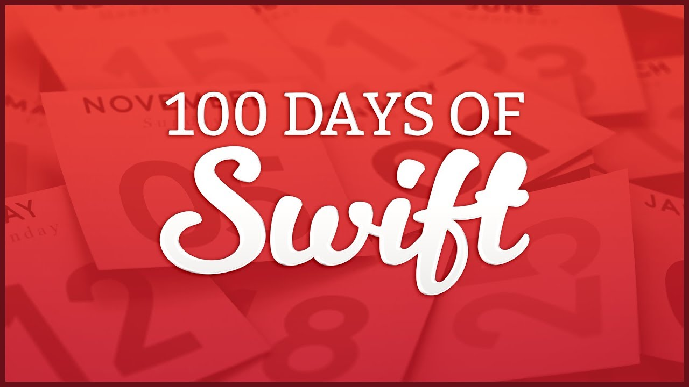

# 100DaysOfSwiftChallenge

## Days 16-22: Starting iOS

| Day(s) | Challenge / Milestone | Swift Language & Frameworks |
| :-----: | :--------------: | :-------------------------- |
| 16-18 | [Project01](https://github.com/ignasiperez/100DaysOfSwiftChallenge/tree/master/D16-18-Project01)   Storm Viewer| **Xcode**, **Interface Builder**.   **Foundation**: `Array`, **`Bundle`**, **`FileManager`**, `String`, Type Casting.   **UIKit**: `UIImage`, `UIImageView`, `UINavigationBar`, **`UINavigationController`**, `UINavigationItem`, **`UITableView`**, **`UITableViewCell`**, **`UITableViewController`** |
| 19-21 | [Project02](https://github.com/ignasiperez/100DaysOfSwiftChallenge/tree/master/D19-21-Project02)   Guess the Flag| **Asset catalogs**, **@2x and @3x images**.   **Core Animation**: `CALayer`   **Foundation**: `Array`, random numbers, `String`.   **UIKit**: Actions, Auto Layout constraints, **`UIAlertController`**, **`UIColor`**, `UIImage`, `UIImageView`|
| 22-22 | [Project03-C1](https://github.com/ignasiperez/100DaysOfSwiftChallenge/tree/master/D22-22-Project03-C1)   Storm Viewer with Sharing | **Info.plist**, **@objc**, Photo Library    **Core Animation**:  `CALayer`   **Foundation**: `Array`, `String`.   **UIKit**: Actions, Auto Layout constraints. **`UIActivityViewController`**, `UIAlertController`, **`UIBarButtonItem`**, `UIImage`, `UIImageView`, **`UINavigationBar`**, **`UINavigationItem`**|
| 22-22 | [Project03-C2](https://github.com/ignasiperez/100DaysOfSwiftChallenge/tree/master/D22-22-Project03-C2)   Storm Viewer with Recommendations | Project01   +    **UIKit**: Actions, `UIActivityViewController`, `UIBarButtonItem`,   `UINavigationItem`|
| 22-22 | [Project03-C3](https://github.com/ignasiperez/100DaysOfSwiftChallenge/tree/master/D22-22-Project03-C3)   Guess the Flag with Message Score| Project02   +    **UIKit**: Actions, `UIActivityViewController`, `UIBarButtonItem`,   `UINavigationItem`|

## Day 23: Consolidation II

| Day(s) | Challenge / Milestone | Swift Language & Frameworks |
| :-----: | :--------------: | :-------------------------------------------- |
| 23-23 | [Milestone-P01-03](https://github.com/ignasiperez/100DaysOfSwiftChallenge/tree/master/D23-23-Milestone-P01-03)   World Flags| Days 16-22 |

## Days 24-31: Web views, user input, and Auto Layout

| Day(s) | Challenge / Milestone | Swift Language & Frameworks |
| :-----: | :--------------: | :-------------------------- |
| 24-26 | [Project04-C2](https://github.com/ignasiperez/100DaysOfSwiftChallenge/tree/master/D24-26-Project04-C2)   Easy Browser | **Delegation**, **Key-value observing (KVO)**.   **Foundation**: **`URL`**, **`URLRequest`**   **UIKit**: **`UIBarbuttonItem`**, `UINavigationBar`, `UINavigationController`, `UINavigationItem`, **`UIProgressView`**, **`UIToolbar`**   **WebKit**: **`WKNavigation`**, **`WKNavigationDelegate`**, **`WKWebView`**|
| 24-26 | [Project04-C3](https://github.com/ignasiperez/100DaysOfSwiftChallenge/tree/master/D24-26-Project04-C3)   Easy Browser with table view  | Project04-C2   +   **UIKit**: **`UITableView`**, **`UITableViewCell`**, **`UITableViewController`** |
| 27-29 | [Project05](https://github.com/ignasiperez/100DaysOfSwiftChallenge/tree/master/D27-29-Project05)   Word Scramble | **Closures**: Weak references  **Foundation**: `NSNotFound`,**`NSString .components(separatedBy:)`**, `NSRange`, **`String .firstIndex(of:) init(contentsOf:) .remove(at:)`**   **UIKit**: **`UITableView .insertRows(at:with:) .reloadData()`**, **`UITextChecker .rangeOfMisspelledWord(...)`** |
| 30-30 | [Project06a](https://github.com/ignasiperez/100DaysOfSwiftChallenge/tree/master/D30-30-Project06a)   World Flag with Landscape View  | Project02   +    **Auto Layout**: Aspect ratio constraints. |
